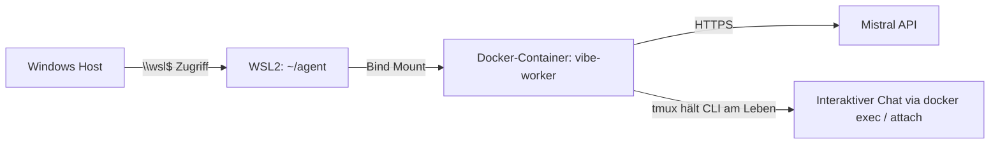

# Minimaler Testlauf: Mistral Vibe im Docker auf Windows

> Ziel: In unter 30 Minuten prüfen, ob die Kombination **Mistral Vibe CLI im Docker-Container + geteilter Ordner + interaktiver Chat über tmux/attach** auf dem eigenen Windows-Rechner funktioniert. Nur **eine** Session, kein Gateway, keine Web-UI.

## Voraussetzungen

- Windows 10/11 mit **WSL2** und installierter Linux-Distribution (z.B. Ubuntu)
- **Docker Desktop** mit WSL2-Backend (siehe [[02 OpenHands auf Windows - Setup und Konfiguration]], Abschnitt Docker-Installation – für diesen Testlauf reicht Schritt 1–2 dort)
- Ein **Mistral API-Key** von [console.mistral.ai](https://console.mistral.ai)
- Grundkenntnisse im Terminal (PowerShell oder WSL-Shell)

## Architektur des Testlaufs



- **Ein Ordner, zwei Welten:** `~/agent` in WSL ist unter Windows über `\\wsl$\<distro>\home\<user>\agent` erreichbar. Alles, was du dort ablegst, sieht der Agent sofort – und umgekehrt.
- **API-Key bleibt auf dem Host:** Der Key liegt als Umgebungsvariable in WSL und wird beim Start an den Container übergeben, ohne in Dateien im geteilten Ordner zu landen.
- **tmux als Keepalive:** Die Vibe-CLI läuft *innerhalb* des Containers in einer tmux-Session. So kannst du den Chat verlassen und wieder einsteigen, ohne den Agenten zu töten.

## Schritt 1: WSL und Ordner vorbereiten

Öffne eine WSL-Shell (z.B. `wsl` in PowerShell oder das Ubuntu-Terminal):

```bash
# Distribution prüfen (sollte WSL2 zeigen)
wsl.exe -l -v

# Agent-Ordner mit Konvention anlegen
mkdir -p ~/agent/incoming ~/agent/outgoing
```

Unter Windows erreichst du den Ordner im Explorer über:
`\\wsl$\Ubuntu\home\<dein-name>\agent` (Distro-Name ggf. anpassen).

## Schritt 2: Dockerfile für den Vibe-Worker

Lege in `~/agent` eine Datei `Dockerfile` an:

```dockerfile
FROM python:3.12-slim

# Vibe CLI installieren (offizielles Paket, gepinnt für Reproduzierbarkeit)
RUN pip install --no-cache-dir mistral-vibe

# tmux als Session-Keepalive
RUN apt-get update && apt-get install -y --no-install-recommends tmux \
    && rm -rf /var/lib/apt/lists/*

# Nicht als root laufen lassen
RUN useradd -m -u 1000 agent
USER agent
WORKDIR /workspace

# Vibe startet in tmux, Container bleibt damit am Leben
CMD ["tmux", "new-session", "-s", "vibe", "vibe"]
```

Bauen (in `~/agent`):

```bash
docker build -t vibe-worker:local .
```

## Schritt 3: Container starten (API-Key vom Host)

Der Key kommt als Env-Variable in den Container – er liegt nie als Datei im geteilten Ordner:

```bash
export MISTRAL_API_KEY="dein-key"   # nur für diese Shell, nicht in .bashrc!
docker run -d --name vibe-test \
  -v ~/agent:/workspace \
  -w /workspace \
  -e MISTRAL_API_KEY \
  --memory 4g --cpus 2 \
  vibe-worker:local
```

> [!WARNING] Sicherheit
> Der `~/agent`-Mount ist **bidirektional und beschreibbar**. Der Agent kann alles in diesem Ordner verändern. Lege deshalb nichts Wertvolles daneben und halte den API-Key außerhalb des Mounts (Env-Variable, nicht `~/agent/.env`).

## Schritt 4: Mit dem Agenten chatten (Variante A)

In die tmux-Session des Containers einsteigen:

```bash
docker exec -it vibe-test tmux attach -t vibe
```

Du siehst jetzt die Vibe-CLI im interaktiven Chat-Modus. Testfragen:

```text
> Erzeuge eine Datei beispiel.md mit einer kurzen Notiz in /workspace/outgoing/
> Was für Dateien liegen in /workspace/incoming?
```

**Container verlassen, ohne ihn zu beenden:** `tmux detach` (Standard: `Ctrl-b` dann `d`). Danach läuft der Chat weiter; mit `docker exec -it vibe-test tmux attach -t vibe` kommst du zurück.

Alternative ohne tmux (wenn du die CLI direkt willst):

```bash
docker exec -it vibe-test vibe
```

> [!NOTE] Neue Chat-Sessions
> `vibe` startet jedes Mal einen frischen Chat-Kontext. Für **mehrere parallele Sessions** im Testlauf: `docker exec -it vibe-test tmux new-session -d -s vibe2 'vibe'` – der Einfachheit halber empfehlen wir für echtes Multi-Session aber direkt OpenHands (siehe Anleitungen 02 und 03).

## Schritt 5: Dateiaustausch testen

1. Lege unter Windows eine Datei in `\\wsl$\Ubuntu\home\<user>\agent\incoming\` ab, z.B. `aufgabe.txt` mit einer Frage.
2. Frage den Agenten im Chat: `> Lies incoming/aufgabe.txt und beantworte die Frage. Schreibe die Antwort nach outgoing/antwort.md`
3. Öffne `\\wsl$\Ubuntu\home\<user>\agent\outgoing\antwort.md` unter Windows – fertig ist der Rundumschlag-Test.

## Schritt 6: Aufräumen

```bash
docker stop vibe-test && docker rm vibe-test
# Optional, wenn du das Image nicht mehr brauchst:
docker rmi vibe-worker:local
```

## Typische Fehler und Lösungen

| Problem | Ursache / Lösung |
|---|---|
| `docker: command not found` in WSL | Docker Desktop aktiviert WSL-Integration für deine Distribution nicht → Docker Desktop → Settings → Resources → WSL Integration |
| Vibe fragt nach API-Key im Chat | `MISTRAL_API_KEY` wurde nicht übergeben oder ist falsch (`docker exec vibe-test env \| grep MISTRAL` prüfen) |
| Dateien aus Windows sind im Container nicht sichtbar | Du bist im falschen Pfad: Der Mount ist `~/agent` → `/workspace`, alles liegt relativ dazu |
| Container stoppt sofort | tmux fehlt oder `CMD` falsch – prüfe mit `docker logs vibe-test` |
| Langsame Datei-I/O beim Windows-Zugriff | Normal bei `\\wsl$`; wer viel hin- und herkopiert, arbeitet besser direkt in WSL |

## Ausblick

- Mehrere Sessions + Web-UI → [[02 OpenHands auf Windows - Setup und Konfiguration]]
- OpenHands lokal auf einem Ubuntu-Laptop → [[03 OpenHands auf Ubuntu 26.04 - Lokal am Laptop]]
- Gleicher Stack headless auf einem Linux-Server → [[04 OpenHands auf Linux - Ubuntu 26.04 headless]]
