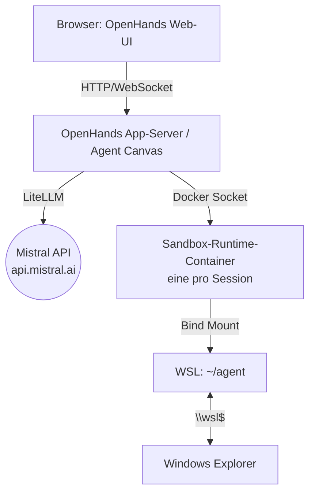

# OpenHands auf Windows: Setup und Konfiguration

> Ziel: OpenHands als Multi-Session-Plattform mit **Mistral-Backend** (Devstral & Co.) auf Windows mit Docker Desktop (WSL2-Backend) betreiben. Inklusive Docker-Installation, API-Key-Konfiguration und geteiltem Ordner `~/agent`.

## Was ist OpenHands (und was nicht)?

OpenHands (früher OpenDevin, inzwischen als "Agent Canvas" für den lokalen Einstieg beworben) ist ein quelloffenes Framework für autonome Coding-Agenten:

- **Web-UI** für Chats mit mehreren parallelen Agenten-Sessions
- **Pro Session ein eigener Sandbox-Container** (isoliertes Dateisystem, eigene Shell)
- **Approval-Gates**: riskante Aktionen (destruktive Bash-Befehle, Credential-Zugriff) pausieren und warten auf Bestätigung
- **Model-agnostisch** über LiteLLM: Mistral-Modelle (Devstral, Codestral, Mistral Medium/Large) sind direkt nutzbar

> [!IMPORTANT] Wichtige Abgrenzung
> OpenHands bringt **seine eigene Agent-Logik** mit. Der Agent darin ist nicht das Mistral Vibe CLI – nur das *Modell dahinter* ist von Mistral. Wer gezielt Vibe-CLI-Verhalten will, nutzt stattdessen [[01 Minimaler Testlauf - Mistral Vibe im Docker auf Windows]].

## Architektur



- Der App-Server hält den **API-Key** (Env-Variable) und spricht Mistral direkt an – der Key gelangt nie in die Sandbox-Container.
- Pro Chat/Session spawnt der App-Server einen isolierten Runtime-Container, in dem der Agent Dateien bearbeitet und Befehle ausführt.
- Dein Ordner `~/agent` wird in jede Sandbox als `/projects` gemountet: der Agent arbeitet direkt auf deinen Dateien, du siehst Änderungen live unter `\\wsl$\…`.

## Schritt 1: Docker Desktop installieren (WSL2-Backend)

Falls Docker bereits läuft, weiter bei Schritt 2.

1. **WSL2 aktivieren** (PowerShell **als Administrator**):
   ```powershell
   wsl --install
   ```
   Standardmäßig wird Ubuntu installiert; Reboot, dann ersten Benutzer in WSL einrichten.
2. **Docker Desktop** von [docker.com](https://www.docker.com/products/docker-desktop/) laden und installieren:
   - Installer ausführen, Haken bei *"Use WSL 2 instead of Hyper-V"* lassen (Standard).
   - Nach dem Start: **Settings → Resources → WSL Integration**:
     - "Enable integration with my default WSL distro" aktivieren
     - Deine Ubuntu-Distribution explizit einschalten
3. **Prüfen** (in WSL-Shell):
   ```bash
   docker --version && docker run --rm hello-world
   ```

> [!TIP] Docker-Socket
> OpenHands benötigt Zugriff auf `/var/run/docker.sock`, um Sandbox-Container zu spawnen. Mit Docker Desktop + aktivierter WSL-Integration ist das automatisch gegeben – der Container bekommt den Socket über `-v /var/run/docker.sock:/var/run/docker.sock` gemountet.

## Schritt 2: Ordner und Umgebung vorbereiten (WSL-Shell)

```bash
# Austauschordner (identisch zum Minimal-Testlauf, s. Anleitung 01)
mkdir -p ~/agent ~/agent-openhands-state

# API-Key als Umgebungsvariable (nicht in Dateien im geteilten Ordner ablegen!)
export MISTRAL_API_KEY="dein-key"
```

Damit der Key nicht bei jedem neuen Terminal eingegeben werden muss, sicher in `.profile` (nicht im Agent-Ordner):

```bash
echo 'export MISTRAL_API_KEY="dein-key"' >> ~/.profile
```

## Schritt 3: OpenHands starten

### Variante A: Agent Canvas (empfohlener lokaler Einstieg)

Der schnellste Weg ist das offizielle Agent-Canvas-Image:

```bash
docker run -it --rm \
  -p 127.0.0.1:8000:8000 \
  -e SANDBOX_USER_ID=1000 \
  -e LLM_API_KEY="$MISTRAL_API_KEY" \
  -e LLM_MODEL="mistral/devstral-medium-2507" \
  -e LLM_BASE_URL="https://api.mistral.ai/v1" \
  -v ~/agent-openhands-state:/home/openhands/.openhands \
  -v ~/agent:/projects \
  -v /var/run/docker.sock:/var/run/docker.sock \
  ghcr.io/openhands/agent-canvas:latest
```

Danach im Browser: **http://localhost:8000**

- `-p 127.0.0.1:8000:8000` bindet die UI nur an Loopback – von anderen Rechnern im Netz ist sie nicht erreichbar.
- `-e SANDBOX_USER_ID=1000` lässt die Sandboxes non-root laufen.
- Der Mount `~/agent:/projects` ist dein bidirektionaler Austauschordner.
- Falls die UI beim ersten Start einen generierten API-Key verlangt (lokaler Modus): auslesen mit
  ```bash
  docker exec <container-name> sh -c 'cat "$STATE_DIR/api-key.txt"'
  ```

### Variante B: Klassischer OpenHands-App-Server (Docker Compose)

Wenn du Conventions wie **GitHub-Issue-Integration** oder das ältere klassische UI-Setup brauchst, orientiere dich am offiziellen Compose-Setup des [OpenHands-Repo](https://github.com/OpenHands/OpenHands) (`docker compose.yaml` im Repo-Root). Wir empfehlen für den Anfang aber die Canvas-Variante – sie ist deutlich weniger Konfiguration.

## Schritt 4: Modell konfigurieren (Mistral)

Die wichtigsten Optionen über Env-Variablen:

| Variable | Wert / Bedeutung |
|---|---|
| `LLM_API_KEY` | Dein Mistral API-Key von [console.mistral.ai](https://console.mistral.ai) |
| `LLM_MODEL` | z.B. `mistral/devstral-medium-2507` (Coding), `mistral/codestral-latest` (Completion), `mistral/mistral-medium-latest` (Generalist) |
| `LLM_BASE_URL` | `https://api.mistral.ai/v1` (OpenAI-kompatibler Endpunkt) |

Oder direkt in der **Web-UI** unter Settings → LLM: Provider "Mistral" (LiteLLM-Präfix `mistral/`) auswählen, Key eintragen, Modell wählen.

> [!TIP] Devstral
> **Devstral** ist Mistral's Modell, das extra für agentic Coding-Aufgaben trainiert wurde (dasselbe Modell, das auch hinter Mistral Vibe steckt) – erste Wahl für Code-Aufgaben in OpenHands.

## Schritt 5: Erste Session und Dateiaustausch testen

1. Browser öffnen: http://localhost:8000
2. **Neue Session / Conversation starten** – im Hintergrund spawnt OpenHands automatisch einen Sandbox-Container.
3. Erste Aufgabe stellen, z.B.:
   ```text
   Lies /projects/incoming/aufgabe.txt und schreibe eine Zusammenfassung nach /projects/outgoing/zusammenfassung.md
   ```
4. Unter Windows im Explorer prüfen: `\\wsl$\Ubuntu\home\<user>\agent\outgoing\zusammenfassung.md` sollte existieren.

### Mehrere Sessions parallel

Starte in der UI einfach weitere Conversations – jede bekommt ihren eigenen Container. N parallele Chats = N isolierte Sandboxes, alle teilen sich aber denselben `~/agent`-Mount:

> [!WARNING] Kollisionsgefahr bei gemeinsamem Mount
> Wenn mehrere parallele Sessions am gleichen `~/agent`-Ordner arbeiten, können sich Agenten gegenseitig Dateien überschreiben. Für disjunkte Aufgaben pro Session Unterordner verwenden (z.B. `~/agent/session-1`, `~/agent/session-2`) oder pro Session einen eigenen Mount planen.

## Schritt 6: Betrieb, Updates, Persistenz

```bash
# Container stoppen (bei --rm ist er danach weg, Zustand bleibt in den Mounts)
docker stop <container>

# Neuestes Image ziehen
docker pull ghcr.io/openhands/agent-canvas:latest
```

- **Persistenz:** Chatverlauf/Session-State liegt in `~/agent-openhands-state` (Mount), Dateien in `~/agent` – ein Container-Neustart verliert nichts.
- **Approval-Policy:** In der UI einstellbar; für Autonomie-Runs "HIGH-risk"-Aktionen auf manuelle Bestätigung lassen (Standardeinstellung).

## Typische Fehler und Lösungen

| Problem | Ursache / Lösung |
|---|---|
| Web-UI nicht erreichbar | Port-Binding prüfen: nur `127.0.0.1:8000:8000` verwenden, Browser auf `localhost` |
| Sandboxes starten nicht / "docker.sock" Fehler | WSL-Integration von Docker Desktop nicht aktiviert (Schritt 1.2), oder Socket-Mount fehlt |
| 401 von Mistral API | Key falsch/abgelaufen – `LLM_API_KEY` prüfen, nie mit führendem/trailingem Leerzeichen |
| Agent sieht Dateien nicht | Sandbox-Mount fehlt (`-v ~/agent:/projects`), oder falscher Pfad im Prompt (`/projects/...` statt Windows-Pfad) |
| Sehr langsames Dateisystem | `\\wsl$`-Zugriff von Windows ist träge – große Dateien besser direkt in WSL ablegen |
| Sicherheitsbedenken bei `docker.sock`-Mount | Bekannter Trade-off: der App-Server darf Container spawnen. Loopback-Binding + keine Port-Weiterleitung nach außen minimiert das Risiko |

## Ausblick

- Schneller Sanity-Check ohne OpenHands: [[01 Minimaler Testlauf - Mistral Vibe im Docker auf Windows]]
- OpenHands lokal auf einem Ubuntu-Laptop → [[03 OpenHands auf Ubuntu 26.04 - Lokal am Laptop]]
- Gleicher Stack headless auf einem Linux-Server → [[04 OpenHands auf Linux - Ubuntu 26.04 headless]]
